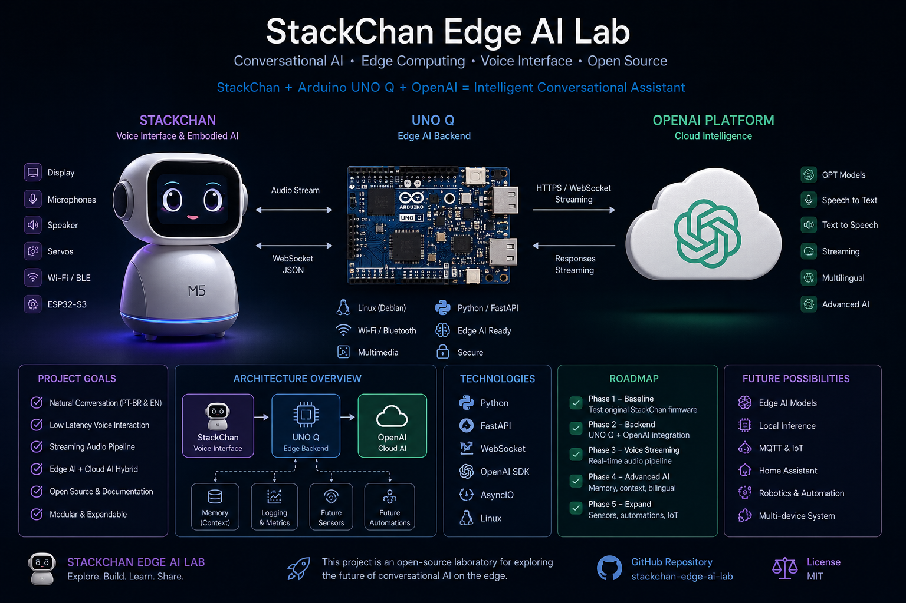

# stackchan-edge-ai-lab

使用 StackChan、Arduino UNO Q、OpenAI 和嵌入式 Linux 的对话式 Edge AI 实验项目。

---

# 项目概览

本项目将逐步记录一个个人对话式 AI 实验室的构建过程，重点关注：

* Voice AI
* Edge AI
* 嵌入式系统
* ESP32-S3
* OpenAI 集成
* 葡萄牙语与英语对话
* 混合 AI 架构
* 对话式 IoT
* 人机交互

项目目标不仅仅是构建一个机器人。

主要目标是创建一个实用且具有教学意义的实验平台，用于：

* 技术学习
* 工程生产力
* 对话式接口
* 双语交互（葡萄牙语/英语）
* Edge AI 实验
* 未来 IoT 集成

---

# 主要硬件

## StackChan

官方文档：

https://docs.m5stack.com/en/StackChan

StackChan 是一个基于 ESP32-S3 的开源桌面 AI 机器人。

主要特性：

* ESP32-S3
* 显示屏
* 双麦克风
* 扬声器
* 舵机
* Wi‑Fi/Bluetooth
* 对话交互
* 开源生态系统

StackChan 将被用作：

* 对话终端
* 物理语音接口
* AI 交互设备
* embodied AI 实验平台

---

## Arduino UNO Q

官方文档：

https://www.arduino.cc/product-uno-q

Arduino UNO Q 是一个现代混合嵌入式平台，结合了：

* Linux 系统
* Qualcomm 处理器
* AI 加速能力
* 实时 MCU
* Wi‑Fi/Bluetooth
* 多媒体支持

UNO Q 初期将作为：

* AI 后端
* OpenAI 网关
* 对话编排服务器
* 实验平台

---

# 初始架构

```text
StackChan (ESP32-S3)
        ↓
Arduino UNO Q
        ↓
OpenAI APIs
```

初始目标是保持架构 SIMPLE。

开始阶段重点关注：

* 语音质量
* 低延迟
* 葡萄牙语支持
* 英语支持
* 对话体验
* 流式传输
* 稳定性

---

# 为什么创建这个项目？

本项目用于探索：

* Edge AI
* Voice AI
* Hybrid AI
* 对话系统
* 嵌入式 Linux
* ESP32 系统
* 人机交互
* 基于语音的技术生产力

示例应用场景：

* 使用语音提出技术问题
* 学习嵌入式系统
* 讨论固件架构
* 练习技术英语
* 在电子实验过程中进行免手操作交互

---

# 项目理念

本仓库遵循一个非常重要的原则：

## 从简单开始。

项目不会立即修改所有内容，而是首先：

1. 测试 StackChan 原厂固件
2. 记录厂商体验
3. 测量限制与优势
4. 建立技术基线
5. 逐步演进

这种方法有助于提高：

* 可重复性
* 学习质量
* 调试效率
* 文档质量
* 后续比较能力

---

# 开发阶段

# 阶段 0 — 项目准备

当前阶段。

目标：

* 准备 GitHub 仓库
* 准备文档
* 准备 Arduino UNO Q
* 学习 OpenAI APIs
* 定义架构

---

# 阶段 1 — StackChan 原始评估

重要说明：

StackChan 将首先按照厂家原始状态进行测试。

本阶段将记录：

* 开箱
* 固件版本
* 首次启动
* Wi‑Fi 配置
* 语音质量
* 葡萄牙语测试
* 英语测试
* 延迟
* 扬声器质量
* 麦克风质量
* 对话质量
* 限制

初期不进行重大修改。

目标是在定制之前充分理解原始平台。

---

# 阶段 2 — OpenAI 集成

目标：

* 将 StackChan 连接到 OpenAI
* 评估对话质量
* 测试双语交互
* 评估延迟
* 比较不同流式方案

计划技术：

* Python
* FastAPI
* WebSocket
* OpenAI SDK

---

# 阶段 3 — UNO Q AI Backend

目标：

* 对话记忆
* 上下文持久化
* 编排层
* Prompt 管理
* 双语助手
* 未来本地 AI 实验

---

# 阶段 4 — Hybrid AI 与 IoT

未来阶段。

可能实验：

* MQTT
* 传感器
* 自动化
* Home Assistant
* 分布式 IoT
* 本地 AI 模型
* 云/本地混合推理

---

# 初始仓库结构

```text
stackchan-edge-ai-lab/
├── README.md
├── docs/
│   ├── 00-overview/
│   ├── 01-unboxing/
│   ├── 02-stock-firmware/
│   ├── 03-initial-tests/
│   ├── 04-ptbr-tests/
│   ├── 05-english-tests/
│   ├── 06-openai-integration/
│   ├── 07-unoq-backend/
│   ├── 08-hybrid-ai/
│   └── future/
├── backend/
├── firmware/
├── hardware/
├── voice/
└── experiments/
```

---

# 初始技术目标

## 语音交互

* 葡萄牙语支持
* 英语支持
* 低延迟
* 自然交互

---

## 教育目标

* 提高技术英语
* 学习嵌入式系统
* 学习 Edge AI
* 公开记录实验

---

## 工程目标

* 模块化架构
* 可复现环境
* 可扩展设计
* 实践性实验

---

# 计划技术

## 嵌入式系统

* ESP32-S3
* 嵌入式 Linux
* Arduino 生态系统

---

## 软件

* Python
* FastAPI
* WebSocket
* asyncio
* OpenAI SDK
* Git/GitHub

---

## AI

* OpenAI APIs
* Voice AI
* 流式交互
* 未来混合 AI 实验

---

# 重要说明

本项目是有意采用渐进式开发方式。

优先级为：

1. 稳定性
2. 语音质量
3. 简洁性
4. 文档质量
5. 学习

本项目并不试图立即构建复杂机器人平台。

主要重点是：

* 对话交互
* 技术生产力
* 实验性
* 教育价值

---

# GitHub 配置

## 本地创建仓库

```bash
git init
```

---

## 添加文件

```bash
git add .
```

---

## 首次提交

```bash
git commit -m "Initial project structure and README"
```

---

## 连接 GitHub 仓库

```bash
git remote add origin https://github.com/YOUR_USER/stackchan-edge-ai-lab.git
```

---

## Push 仓库

```bash
git branch -M main
git push -u origin main
```

---

# 建议的首批任务

## 在 StackChan 到达之前

* 准备 Arduino UNO Q
* 安装 Python 环境
* 配置 Git 与 SSH
* 测试 OpenAI APIs
* 组织仓库结构
* 规划文档

---

# 未来想法

未来可能方向：

* 本地 AI 推理
* 语音流优化
* wake-word 检测
* embodied AI 实验
* 传感器集成
* Home Assistant 集成
* 双语工程助手
* Edge AI 基准测试

---

# License

项目许可证目前仍在评估中。

未来可能选项：

* MIT
* Apache 2.0

---

# 最终说明

本仓库目标是成为：

* 学习平台
* 工程实践参考
* 对话式 Edge AI 实验室
* 双语技术文档项目

项目将逐步演进，并持续进行详细记录。
